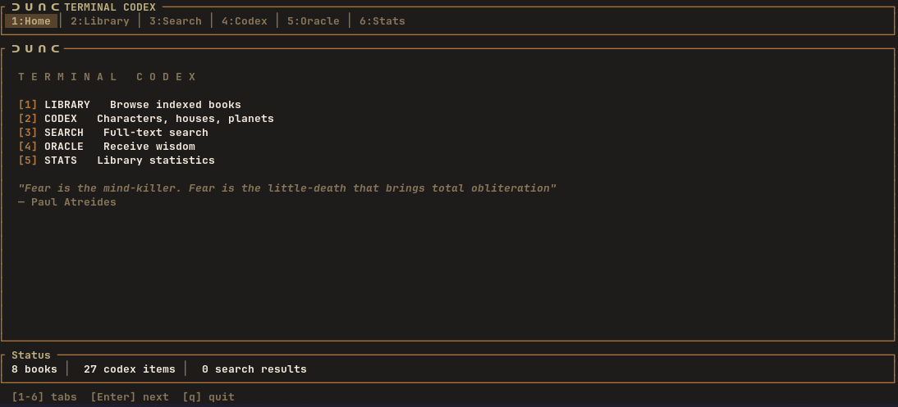

# Dune Terminal Codex

An encyclopedia of the Dune universe that lives in your terminal.

I watched the movie, bought book six, and discovered I had no idea who anyone
was. I spent more time juggling wiki tabs than actually reading. So instead of
just keeping a browser tab open like a normal person, I built a SQLite
full-text index, a TUI, and an Oracle. Peak over-engineering. Now other fans
can profit from my complete lack of restraint.



## What it does

- Indexes your personal PDF collection of the saga for full-text search
  (FTS5 with bm25 relevance ranking).
- Fuzzy-searches your books with typo tolerance (trigram FTS) from the TUI:
  type `atelides` and it still finds Atreides.
- Populates a codex of characters, Great Houses, planets and glossary terms,
  courtesy of [julian31186/dune-api](https://github.com/julian31186/dune-api)
  (data from the official [Dune Wiki](https://dune.fandom.com/)).
- Dispenses quotes and random wisdom via the Oracle.
- Exports library and codex as Markdown or JSON.
- Works as an interactive TUI (`dune`) and as plain CLI commands.

Everything runs locally against your own files; the only step that touches the
network is the codex import.

Built with Rust, `ratatui` 0.30 and `rusqlite`.

## Requirements

- Linux (built and tested on Arch Linux; other platforms are untested)
- Rust stable (`rustup` recommended)
- `pdftotext` / `pdfinfo` (poppler-utils) for PDF indexing
- A PDF viewer for `dune open` (default: `okular`, configurable via
  `[reader] command`; opening at a specific page only works with okular)

## Build

```sh
cargo build --release
# binary at target/release/dune
```

To put `dune` on your PATH (all README examples assume this):

```sh
cargo install --path .
# installs dune into ~/.cargo/bin; rerun after updating the repo
```

## First use

The repo ships with a `PDFS/` folder (currently empty — it is gitignored) as
the ready-made place for your saga PDFs. Two ways to get indexed:

**Zero-config (recommended for clones):** drop your PDFs in `PDFS/`, then
index them directly without touching any config:

```sh
dune index --file PDFS/*.pdf   # index just these files
dune import-codex              # fetch characters, houses, planets, glossary
```

**Config-based (recommended for your own library):** create the default
config and point `[library] paths` at your books folder:

```sh
dune config        # creates ~/.config/dune/config.toml
```

Edit `[library] paths` in `~/.config/dune/config.toml` (it defaults to
`~/Books/Dune`), then:

```sh
dune index         # scan library paths and index every PDF (full-text)
dune import-codex  # fetch characters, houses, planets and glossary
```

Either way, you can then launch the TUI with `dune` (or `cargo run`).

## Command reference

| Command                  | Description                                        |
|--------------------------|----------------------------------------------------|
| `dune` / `dune tui`      | Launch the interactive TUI                         |
| `dune search <query> [--book <name>]` | Exact keyword full-text search, optionally filtered by book (the TUI Search tab is the fuzzy one) |
| `dune books`             | List indexed books                                 |
| `dune book <name>`       | Show details of one book                           |
| `dune character <name>`  | Codex entry for a character                        |
| `dune house <name>`      | Codex entry for a Great House                      |
| `dune planet <name>`     | Codex entry for a planet                           |
| `dune glossary [term]`   | Browse or look up glossary terms                   |
| `dune quote`             | Random quote                                       |
| `dune oracle`            | Random wisdom from the Oracle                      |
| `dune stats`             | Library statistics                                 |
| `dune index [--rebuild] [--verbose] [--file <pdf>...]` | Index/reindex PDFs |
| `dune import-codex`      | Import/refresh codex data (idempotent re-import)   |
| `dune export [--format markdown\|json] [-o <file>]` | Export library and codex to stdout or a file |
| `dune config`            | Show configuration location and contents           |
| `dune open <path\|id> [--page N]` | Open a PDF at a page, by path or by the id shown in `dune books` |

Example:

```sh
dune export --format json -o codex.json
dune export --format markdown        # to stdout
```

## TUI keybindings

| Key            | Action                                            |
|----------------|---------------------------------------------------|
| `1`–`6` / Tab  | Switch tabs (Home, Library, Search, Codex, Oracle, Stats) |
| `j` / `k`      | Move down / up                                    |
| `PgUp` / `PgDn`| Scroll by page                                    |
| `g` / `G`      | Jump to start / end                               |
| `Enter`        | Open item (book, codex entry, next tab on Home)   |
| `c`            | Cycle Codex category                              |
| `r`            | New Oracle wisdom                                 |
| type           | Live fuzzy search in the Search tab (typo-tolerant) |
| `Esc` / `q`    | Back / close detail / quit                        |

In a Codex detail view: `j/k` scroll line by line, `PgUp/PgDn` by page,
`g/G` jump to top/bottom; the footer shows the current line position.

## Configuration

Config file: `~/.config/dune/config.toml` (created by `dune config`).

| Key                    | Default            | Purpose                          |
|------------------------|--------------------|----------------------------------|
| `[library] paths`      | `["~/Books/Dune"]` | Folders scanned by `dune index`  |
| `[reader] command`     | `"okular"`         | PDF viewer used by `dune open`   |
| `[reader] args`        | `[]`               | Extra arguments for the viewer   |
| `[codex] wiki_url`     | Dune API endpoint  | Source used by `dune import-codex` |

The database lives at `~/.local/share/dune/dune.db`; delete it (or run
`dune index --rebuild`) to start over. The fuzzy-search index adds roughly
2.5–3× the size of the indexed page text to the database; it is rebuilt
automatically by `dune index`.

## Development

Rust project (`edition = 2024`). Run the test suite with:

```sh
cargo test    # 125 tests: unit + CLI integration
```

CLI integration tests are hermetic: they spawn the built binary and point it
at a temp database via `DUNE_DB_PATH` (a test hook that overrides the default
XDG location when set). No network or PDF tooling is needed to run them.

## License

MIT — see [LICENSE](LICENSE).
